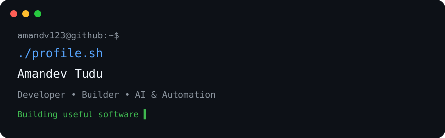

<div align="center">



# 👋 Hey, I'm Amandev

### Developer • Builder • AI & Automation Enthusiast

<p>
  
</p>

<p>
  <a href="https://github.com/amandv123"></a>
  
  
  
</p>

</div>

<div align="center">


</div>

---

## 🧑‍💻 About Me

I'm **Amandev Tudu**, a developer from Odisha who enjoys turning ideas into useful products.

I build mobile apps, web applications, automation tools, and AI-powered systems — with a focus on practical UX, reliable architecture, and learning by building.

```text
Amandev@github:~$ whoami

Developer
├── 📱 Mobile Apps
├── 🌐 Web Applications
├── 🤖 AI & Automation
├── ☁️ Cloud & Backend
└── 🛠️ Open-source experiments
```

---

## 🚀 Featured Projects

<table>
<tr>
<td width="50%" valign="top">

### 🌾 Kisan Khata

**Smart Farm Ledger**

Offline-first farm ledger built for practical day-to-day farming records, with local SQLite storage and cloud sync.

**React Native · Expo · TypeScript · SQLite · Supabase**

<a href="https://github.com/amandv123/kisan-khata">View project →</a>

</td>
<td width="50%" valign="top">

### 🤖 TelePilot

**Telegram AI Agent**

AI-powered Telegram agent with intent parsing, context management, planning, policy, tools, search and automation.

**Python · FastAPI · Telegram · AI**

<a href="https://github.com/amandv123/telepilot">View project →</a>

</td>
</tr>

<tr>
<td width="50%" valign="top">

### 🌐 DriveClone

**Move files. Not storage.**

A modern file transfer and storage experience inspired by cloud-drive workflows.

**React · TypeScript · Tailwind**

<a href="https://github.com/amandv123/DriveClone">View project →</a>

</td>
<td width="50%" valign="top">

### 🔗 AD Shortner

**Ad-supported URL Shortener**

A lightweight short-link platform with aliases, password protection, timed ad flow and an admin dashboard.

**Cloudflare Workers · Wrangler**

<a href="https://github.com/amandv123/ad-shortner">View project →</a>

</td>
</tr>

<tr>
<td width="50%" valign="top">

### 🌱 Sukanti Agricultural Works

**Agricultural Service Website**

A responsive business website showcasing agricultural services and machinery for farmers in Odisha.

**React · Vite · TypeScript · Tailwind**

<a href="https://github.com/amandv123/sukanti-agricultural-works">View project →</a>

</td>
<td width="50%" valign="top">

### 🧪 More Experiments

**Always building something new**

From automation bots to AI agents and utility tools, I like turning small ideas into working prototypes.

<a href="https://github.com/amandv123?tab=repositories">Explore all repositories →</a>

</td>
</tr>
</table>
---

## ⚡ Tech Stack

<table>
<tr>
<td width="50%" valign="top">

### 💻 Languages

<div align="center">


</div>

</td>
<td width="50%" valign="top">

### 🎨 Frontend & Mobile

<div align="center">


</div>

</td>
</tr>
<tr>
<td width="50%" valign="top">

### ☁️ Backend & Cloud

<div align="center">


</div>

</td>
<td width="50%" valign="top">

### 🛠️ Tools & Workflow

<div align="center">


</div>

</td>
</tr>
</table>
---

## 🛠️ Tools I Work With

<div align="center">


</div>

---

## 🔗 Connect

<div align="center">

<a href="https://github.com/amandv123">GitHub</a> ·
<a href="https://github.com/amandv123?tab=repositories">Repositories</a> ·
<a href="https://github.com/amandv123/kisan-khata">Kisan Khata</a> ·
<a href="https://github.com/amandv123/telepilot">TelePilot</a>

</div>

---

## 🧠 Currently Building

<table>
<tr>
<td width="50%" valign="top">

### 🤖 TelePilot

**AI-powered Telegram agent**

> Building an intelligent Telegram assistant with intent parsing, context management, planning, policy, tools, search and automation.

**Focus**
- 🧠 Agent architecture
- 🔎 Search & URL processing
- 🛡️ Security & policy
- ⚙️ Tools & automation

**Status:** ACTIVE DEVELOPMENT

<a href="https://github.com/amandv123/telepilot">View TelePilot →</a>

</td>
<td width="50%" valign="top">

### 🌾 Kisan Khata

**Smart Farm Ledger**

> Building an offline-first farming ledger with local data safety, Supabase authentication and cloud synchronization.

**Focus**
- 📱 Mobile UX
- 💾 Offline-first SQLite
- ☁️ Cloud sync
- 🔐 Account linking

**Status:** ACTIVE DEVELOPMENT

<a href="https://github.com/amandv123/kisan-khata">View Kisan Khata →</a>

</td>
</tr>
</table>

> 💡 **Build → Test → Fix → Ship → Improve**
---

## 🌐 Profile

<div align="center">


<br><br>

<a href="https://github.com/amandv123/kisan-khata">
  
</a>
<a href="https://github.com/amandv123/telepilot">
  
</a>

</div>

---

## 📊 GitHub Activity

<div align="center">

<a href="https://github.com/amandv123">
  
</a>
<a href="https://github.com/amandv123">
  
</a>

<br><br>


</div>

---

## 🐍 Contribution Activity

<div align="center">

<a href="https://github.com/amandv123">
  
</a>

</div>

---

## 🎯 What I Like Building

> **Ideas → Design → Code → Test → Ship → Improve**

I enjoy projects where software solves a real problem — especially tools that combine **AI, automation, mobile apps, and cloud services**.

---

<div align="center">

---

### 👋 Thanks for stopping by

**Build • Ship • Learn • Repeat**

If you found something useful here, feel free to ⭐ a repository or explore the projects below.

<a href="https://github.com/amandv123?tab=repositories">
  
</a>

<br><br>


</div>
